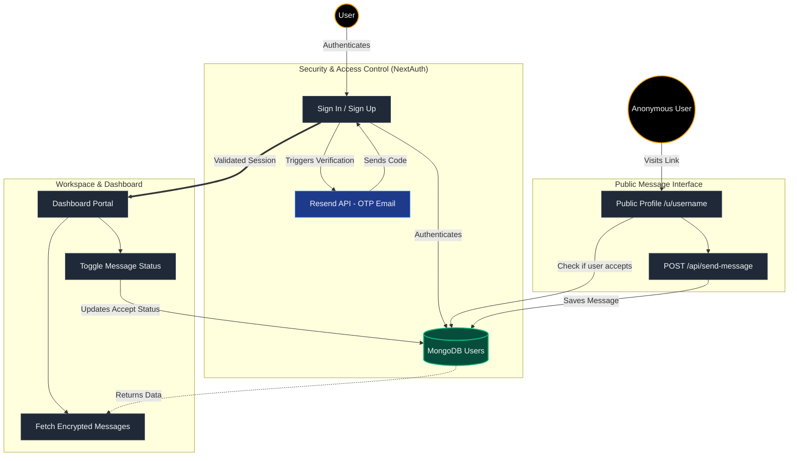

# Aura Messenger

**Live Demo:** [https://aura-messanger.vercel.app/](https://aura-messanger.vercel.app/)

Aura Messenger is an industrial-grade secure anonymous messaging platform designed for clarity and absolute privacy. With a stunning glassmorphism aesthetic and robust backend architecture, Aura allows users to generate unique links to receive feedback securely.

## 🚀 Features

- **Anonymous Feedback:** Receive messages from anyone while preserving total anonymity for the sender.
- **Glassmorphism UI:** A sleek, premium dark-themed UI built meticulously with Tailwind CSS.
- **Secure Authentication:** NextAuth v5 integration with email-based OTP (One-Time Password) verification.
- **Session Control:** Secure JWT sessions configured for Vercel's Edge runtime.
- **Message Management:** Toggle message acceptance and view incoming transmissions from a centralized Dashboard.
- **Responsive Design:** Fully responsive layout with mobile-optimized navigation.

## 🛠️ How to Use It

### 1. Setup & Installation
Clone the repository and install the dependencies:
```bash
npm install
```

### 2. Environment Variables
Create a `.env` file in the root directory and configure the following keys:
```env
MONGODB_URI=your_mongodb_connection_string
RESEND_API_KEY=your_resend_api_key
AUTH_SECRET=your_nextauth_secret
```

### 3. Run the Development Server
Start the Next.js development server:
```bash
npm run dev
```
Navigate to `http://localhost:3000` to access the application.

### 4. Application Flow
1. **Generate Link:** Sign up, verify your email using the OTP sent via Resend, and access the Dashboard.
2. **Share Network:** Copy your unique transmission link (`/u/[username]`) from the Dashboard and share it with your audience.
3. **Receive Feedback:** Anonymous users can visit your public link and submit messages to you.
4. **Manage Transmissions:** Read, manage, and toggle your messaging status securely from your Dashboard.

---

## 🏗️ System Architecture

The following diagram illustrates the complete data flow, authentication procedures, and messaging mechanics of the Aura Messenger platform:



## 💻 Tech Stack
- **Framework:** Next.js (App Router)
- **Styling:** Tailwind CSS + Radix UI + Lucide Icons
- **Database:** MongoDB (via Mongoose)
- **Authentication:** NextAuth v5 (Auth.js)
- **Email Service:** Resend + React Email
- **Validation:** Zod + React Hook Form
